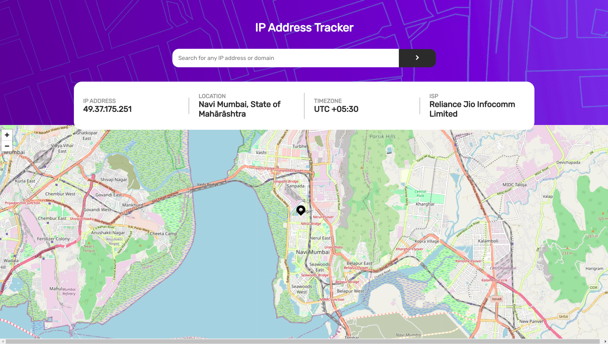
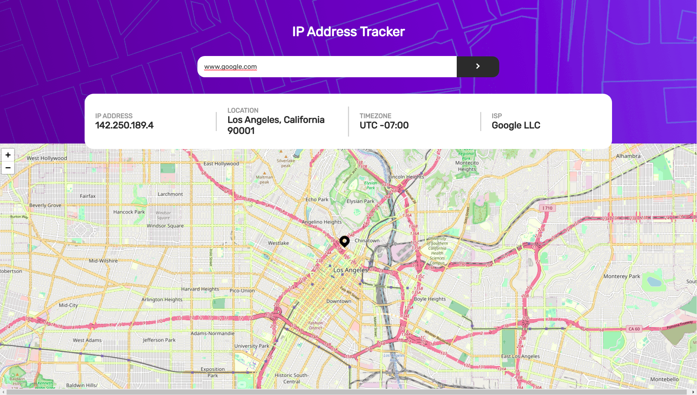
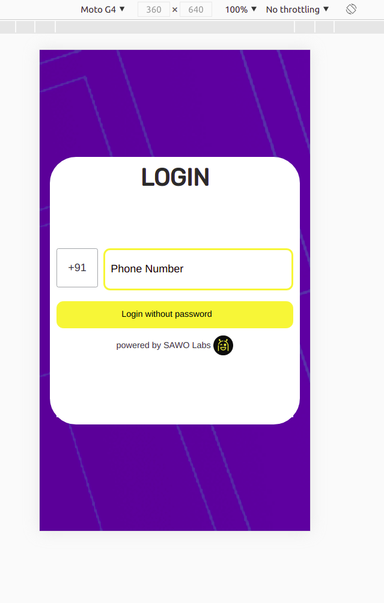
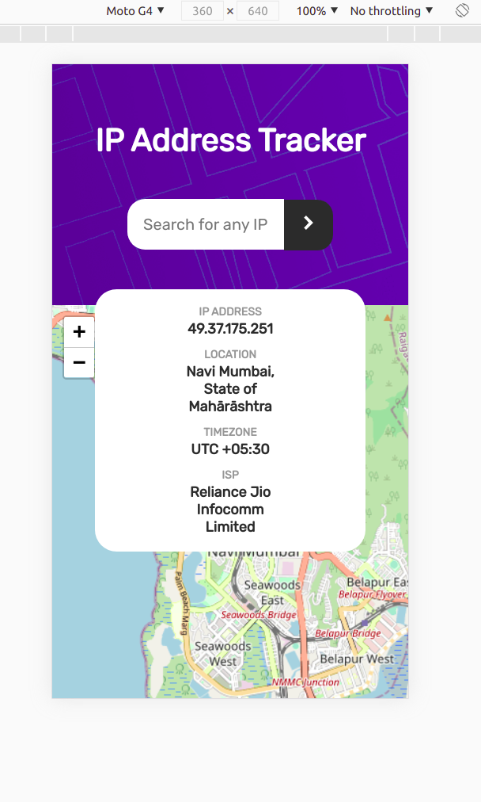
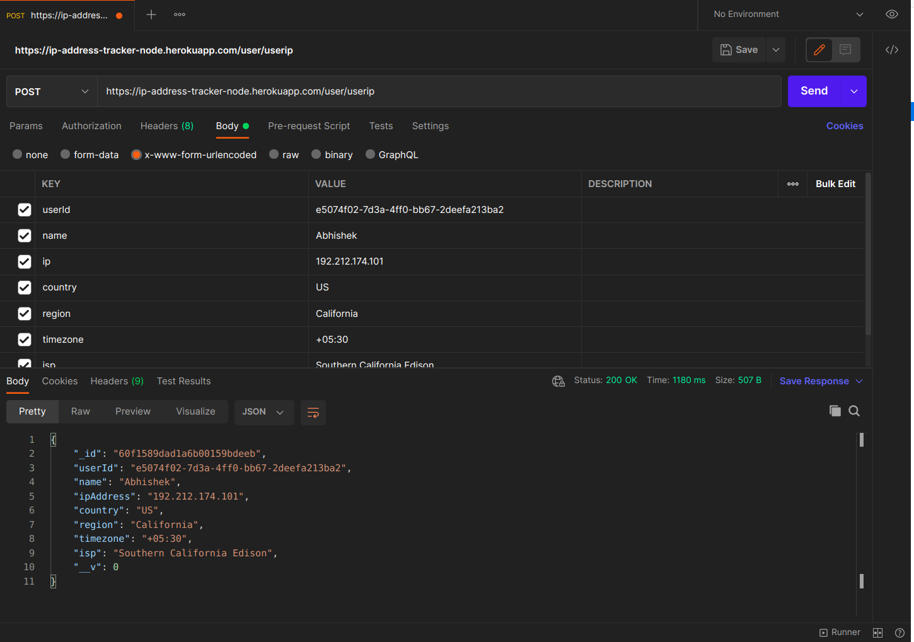

# IP address tracker

## Table of contents

- [Overview](#overview)
  - [The challenge](#the-challenge)
  - [Links](#links)
- [My process](#my-process)
  - [Built with](#built-with)

## Overview

### The challenge

Users should be able to:

- Login using SAWO sdk (the passwordless way)
- View the optimal layout for each page depending on their device's screen size
- See hover states for all interactive elements on the page
- See their own IP address on the map on the initial page load
- Search for any IP addresses or domains and see the key information and location

### Screenshot

- #### **WEB VIEW**
- Web Login Page:
  
- Web Dashboard Page:
  
- Web Dashboard Page on Value:
  

- #### **MOBILE VIEW**

- Mobile Login View.
  
- Mobile View.
  
- Mobile View.
  

- #### **POSTMAN CALL**

- Postman call for saving the data.
  

### Links

- Solution Site URL:
  - [Front-end](https://github.com/theshakeabhi/ip-address-tracker)
  - [Back-end](https://github.com/theshakeabhi/ip-address-tracker-node)
- Live Site URL: [IP Address Tracker Link](https://ip-address-tracker-fe.herokuapp.com/)

## My process

### Built with

- [React](https://reactjs.org/) - JS library
- [Sawo](https://sawolabs.com/) - Passwordless Authentication
- [IP Geolocation API](https://geo.ipify.org/) - An IP locator API
- [Leaftlet](https://leafletjs.com/) - A Map Library
- [React Leaflet](https://react-leaflet.js.org/) - React components for Leaflet maps
- [Axios](https://axios-http.com/) - Promise based HTTP client for the browser and node.js
- Flexbox
- Media Query - For responsive mobile view
